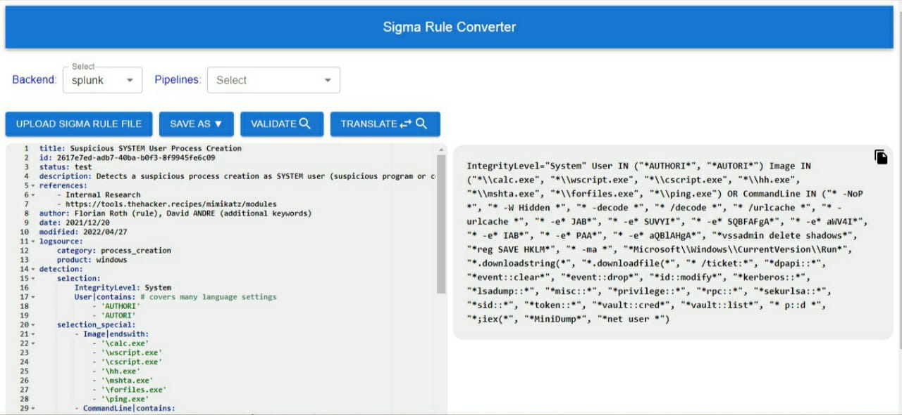

# Sigma Translator

Sigma Translator App is a tool for converting Sigma rules to various SIEM formats.

## Table of Contents

- [Getting Started](#getting-started)
  - [Prerequisites](#prerequisites)
- [Usage](#usage)
- [Features](#features)

## Getting Started

### Prerequisites

Ensure you have the following prerequisites installed:

- Python 3.10.11 or above
- flask
- Flask-CORS
- pySigma

## Usage
Run the Sigma Translator App with the following command:

cd frontend
yarn start

Visit the web application at http://localhost:3000/sigmaTranslate in your browser.

## Features
- **Convert Sigma Rules:** Transform Sigma rules into various output formats.
- **Upload and Translate:** Easily upload Sigma rule files and translate them effortlessly.
- **Edit and Download:** Modify Sigma rule files and conveniently download the updated versions.

